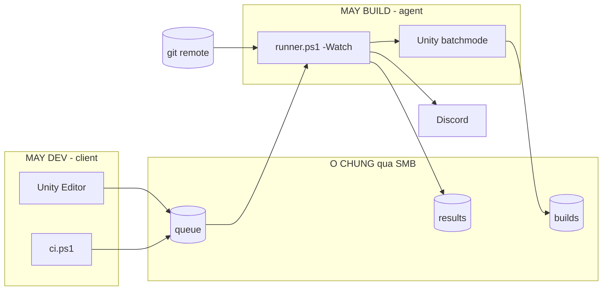

# Unity CI Build

> **Unity builds. You keep working.**
> **Unity build. Bạn vẫn làm việc.**

Build game Unity chạy nền — trên chính máy bạn hoặc trên một máy khác trong mạng — để Unity Editor không bị khoá.

**EN** — A background build tool for Unity on Windows. Trigger a build from the Editor menu, a `.bat`, or PowerShell; it builds on a separate git worktree (or an entirely separate machine on your LAN) so your Editor stays usable. Reports progress and results to Discord. Vietnamese UI; the code and this section are the only English you need.

---

## Vấn đề

Bấm Build trong Unity là Editor khoá cứng 20–40 phút. Không sửa được script, không mở được scene, không làm gì được.

Nguyên nhân là Unity khoá thư mục `Library/`. Nên cách duy nhất để vừa build vừa làm việc là có **một bản sao thứ hai** của project với `Library/` riêng.

Tool này dựng sẵn bản sao đó và điều khiển nó.

---

## Cài đặt

Double-click **`install.bat`**. Hết.

```
  KIEM TRA HE THONG
  ----------------------------------------------------------
  [OK]    PowerShell 5.1
  [OK]    winget
  [OK]    Git 2.45.1
  [OK]    Unity Hub
  [OK]    Unity 6000.0.70f1 (khop voi project)
  [OK]    Android Build Support
```

Thiếu **git** hoặc **rclone** thì nó tự cài. Thiếu **Unity** thì không — Unity bắt buộc đăng nhập license bằng tay qua Hub, không tự động được; nó chỉ in đúng đường dẫn menu để bạn bấm.

### Bạn cần chuẩn bị

| | Bắt buộc | |
|---|:---:|---|
| Thư mục project Unity, đã là git repo | ✓ | Build lấy code từ commit |
| Một ổ còn trống ~60 GB | ✓ | Chứa bản sao thứ hai |
| Unity Hub + Editor + Android Build Support | ✓ | Trình cài kiểm tra và chỉ chỗ |
| Webhook một kênh Discord | | Nhận thông báo build |
| Nơi đẩy file cho tester | | Một đường dẫn folder là đủ |
| File keystore | | Chỉ khi build release |

### Bạn nhận được gì

```
✓ Menu CI Build trong Unity — bấm một phát, Editor rảnh ngay
✓ File APK/AAB đặt tên theo ngày giờ + branch + commit
✓ Discord báo tiến độ và kết quả
✓ Build hỏng thì có errors.txt liệt kê đúng dòng lỗi
```

---

## Dùng hằng ngày

**Trong Unity** — `CI Build > Bảng điều khiển`, hoặc `Ctrl+Alt+B` để build nhanh APK dev.

**Không mở Unity** — double-click `build.bat`.

**PowerShell:**

```powershell
.\ci.ps1 build                              # APK dev, branch đang đứng
.\ci.ps1 build -Branch release/1.2          # branch khác, KHÔNG đổi working copy
.\ci.ps1 build -Project SE-001              # project khác
.\ci.ps1 build -Format aab -Config release  # AAB release
.\ci.ps1 branches                           # liệt kê branch
.\ci.ps1 cancel                             # xem / huỷ job
.\ci.ps1 status                             # đang build gì, kết quả gần đây
.\ci.ps1 projects                           # project đã khai báo
.\ci.ps1 config                             # xem / đổi đường dẫn
.\ci.ps1 doctor                             # kiểm tra lại máy
```

---

## Cách nó chạy

```
  Unity menu ─┐
  build.bat  ─┼──►  queue/  ──►  runner  ──►  worktree riêng
  ci.ps1     ─┘                     │              │
                                    │              ▼
                                    │       Unity batchmode
                                    │              │
                                    ▼              ▼
                            Discord + log      APK / AAB
```

**Worktree** là bản sao thứ hai, do `git worktree` tạo ra. Nó dùng chung kho object với repo gốc nên không tốn thêm dung lượng git, nhưng có `Library/` riêng — đó chính là lý do Editor của bạn không bị khoá.

**Queue là drop-folder.** Ghi file `.tmp` rồi đổi tên. Đổi tên là thao tác nguyên tử, nên nhiều nguồn cùng đẩy job vào không đụng nhau, và runner không bao giờ đọc phải file đang ghi dở.

**`CIBuild.cs` được bơm vào worktree mỗi lần build**, sau bước `git clean`. Nhờ vậy build được cả những commit cũ chưa hề có script CI, và bạn không cần commit gì trước khi build lần đầu.

**Không dùng `-quit`.** `EditorApplication.Exit(code)` tự gọi, vì `-quit` luôn trả exit 0 kể cả khi build fail — runner sẽ tưởng thành công.

---

## Build trên máy khác

Một máy đặt lệnh, một máy khác build. Máy dev không đụng gì tới CPU nữa.



Chạy `install.bat` trên **cả hai máy**, chọn vai trò khác nhau:

| | Chọn | Cần nhập gì |
|---|---|---|
| Máy dev | `[1] May dev` | Project Unity, thư mục CI trỏ vào `\\BUILDPC\UnityCI` |
| Máy build | `[2] May build` | Thư mục làm việc + webhook Discord — **không cần chọn project** |

Máy build **tự nhận project**: gặp job của project lạ, nó clone từ `gitRemote` kèm trong job, đọc `ProjectVersion.txt` để biết bản Unity, tìm editor khớp rồi tự ghi vào config. Thêm project mới chỉ phải cấu hình ở máy dev.

Ba điều khác khi chạy hai máy:

- **Commit chưa push thì bị chặn** — máy build clone từ remote nên không thấy commit local. Kiểm tra trước khi xếp hàng, không để build chạy rồi mới chết.
- **Webhook Discord nằm ở máy build**, vì nó mới là bên gửi thông báo.
- **Job được giành bằng đổi tên file** (`queue/` → `processing/<agent>/`). Rename là nguyên tử kể cả trên ổ mạng; hai agent nhảy vào cùng một job thì một cái thất bại và bỏ qua. Mutex chỉ chặn được trong phạm vi một máy.

`ci.ps1 status` hiện máy build còn sống hay đã chết — agent ghi nhịp tim mỗi vòng lặp, im quá 60 giây là coi như chết. Dừng agent: tạo file `agent-stop.flag`.

**Nên bật auto-login cho máy build.** Scheduled Task dùng trigger "khi đăng nhập" là có chủ ý — Unity cần một phiên đăng nhập thật mới build ổn định; chạy kiểu dịch vụ nền hay vỡ ở khâu compile shader.

### Máy build tắt thì sao

Tool **hỏi**, không tự ý build tại chỗ — máy dev tự nhiên ăn hết CPU mà không rõ lý do là chuyện khó chịu:

```
[THIEU] Khong thay may build nao dang chay.

    [1] De job trong queue - may build bat len la tu chay
    [2] Build ngay tai may nay
        -> Lan dau phai tao ban sao project + import lai toan bo asset:
           mat 20-40 phut va an gan het CPU. Doi may build co khi con nhanh hon.
```

Bỏ qua câu hỏi: `.\ci.ps1 build -Local` hoặc `-Queue`. Chọn build tại chỗ thì job được **ghim tên máy**, nên máy build bật lên sau đó cũng không cướp mất.

---

## Theo dõi tiến độ

Mỗi build là **một card Discord duy nhất** — tự sửa nội dung mỗi ~20 giây rồi kết thúc thành kết quả, không đẻ thêm tin nhắn.

```
Dang build...
fix combo bug

  Giai doan: IL2CPP (bien ma)
  [#######.....]  4m 10s / ~12m (uoc tinh)

Project            Branch        Commit
in006-cake-roll    main          45ce359
```

**Không có phần trăm thật.** Unity không phát ra tiến độ ở batchmode — không API, không dòng log nào. Nên:

- **Giai đoạn** là thật, đọc từ log Unity theo thời gian thực. Chỉ tiến, không lùi, nên không nhấp nháy khi log các chặng xen kẽ.
- **ETA** là trung vị 5 lần build **thành công** gần nhất của đúng project + đúng loại. Trung vị chứ không phải trung bình, để lần build đầu 40 phút không kéo lệch mọi ước tính sau.
- **Bar** chạy theo `đã chạy / ETA`, luôn ghi "(uoc tinh)", và không bao giờ đầy khi chưa xong.

Chưa đủ số liệu thì nó ghi thẳng `chua co so lieu de uoc tinh` thay vì bịa.

Bảng nhận diện giai đoạn nằm ở đầu `lib/UnityLog.ps1`, tách riêng để dễ chỉnh.

---

## Huỷ build

```powershell
.\ci.ps1 cancel            # xem job đang chờ / đang chạy
.\ci.ps1 cancel <id>       # huỷ một job
.\ci.ps1 cancel -All       # huỷ sạch
```

Trong Unity có nút **Huỷ** hiện dưới nút Build khi có job đang chạy.

- **Job đang chờ** — xoá file khỏi queue, xong ngay.
- **Job đang chạy** — không giết tiến trình từ xa được (có thể ở máy khác), nên đặt file cờ `cancel/<id>.flag`. Runner nhặt ở **vòng poll 3 giây sẵn có** rồi tự giết Unity.

Build bị huỷ **không bị coi là thất bại**: Discord tô xám, tiêu đề `BUILD DA HUY`, không sinh `errors.txt` — có gì hỏng đâu mà đọc log.

---

## Chọn branch

```powershell
.\ci.ps1 build -Branch release/1.2
```

Điểm mấu chốt: nó **không `checkout`, không đụng working copy của bạn**. Tool đọc thẳng đỉnh của branch đó (`git rev-parse`), lấy sha và số commit từ đấy, rồi gửi đi build. Bạn đang sửa dở gì trên `feature/abc` thì vẫn nguyên đó.

Đây là thứ phân biệt build server với build tay: bạn **không phải dừng việc đang làm** để phát hành một bản từ branch khác.

Nhận cả branch local lẫn remote — gõ `release/1.2` thì nó thử `release/1.2` trước, không có thì thử `origin/release/1.2`. Gõ sai tên thì nó liệt kê branch đang có thay vì báo lỗi cụt.

Trong Unity có dropdown **Branch** ngay trên nút Build, mặc định là branch đang mở.

Vì `versionCode` tính theo số commit **của branch được chọn**, đổi branch rất dễ đụng cảnh báo trùng versionCode bên dưới.

---

## Chống build nhầm

**Đổi branch** so với lần build trước của project đó thì dừng lại hỏi. Cùng branch thì im.

**Thay đổi chưa commit** thì cảnh báo — build lấy đúng commit HEAD, nên mỗi file build truy ngược được về một commit.

**Trùng `versionCode`** thì cảnh báo. Đây là cái bẫy âm thầm nhất:

```
[THIEU] versionCode 122 da dung cho commit aaa1111 (branch main).
        -> Android coi hai ban nay la MOT: cai chong len may test se KHONG update.
```

`versionCode` = số commit, mà hai branch rất dễ có cùng số commit. Hai APK khác nội dung nhưng cùng `versionCode` → cài chồng lên không update → ngồi test nhầm bản cũ mà không biết.

Tool **chỉ cảnh báo, không tự đổi con số** — `versionCode` đi thẳng lên Play Store, sửa bừa còn nguy hiểm hơn. Bù lại tên file kèm branch để nhìn là phân biệt được:

```
20260916-0018-feature-combo-45ce359-dev.apk
```

---

## Đưa file cho tester

Chọn một trong ba lúc cài:

| Cách | Nhập gì | Đổi lại |
|---|---|---|
| **Không cần** | — | File chỉ nằm trên máy build |
| **Copy sang folder khác** | Một đường dẫn | Đơn giản nhất. Trỏ vào folder Google Drive Desktop / MEGA / OneDrive / ổ mạng — client tự đồng bộ |
| **rclone** | Đăng nhập Google một lần (~1 phút) | Tự tạo link tải riêng cho từng file |

**Chỉ dán link Drive thôi thì không đủ** — link là địa chỉ, không phải chìa khoá; Google bắt buộc OAuth mới cho ghi. Nhưng nếu đã share sẵn folder và có link, dán vào lúc cài thì Discord kèm link đó vào mọi thông báo.

Chọn rclone thì wizard tự chạy `rclone config create gdrive drive scope=drive` — lệnh này lấy mặc định cho mọi câu hỏi, nên cuộc phỏng vấn ~10 bước rút còn một bước: bấm Allow trên trình duyệt.

Build xong mà file không tới được tester thì Discord **không báo xanh** — card chuyển màu cam, tiêu đề `BUILD XONG - NHUNG UPLOAD HONG`, kèm lý do và đường dẫn file còn nằm trên máy build. Báo xanh ở đây là nói dối: tester sẽ ngồi đợi một file không bao giờ đến.

`ci.ps1 doctor` thử thật đích đến trước khi bạn tốn 20 phút build, và cảnh báo nếu hai project trỏ vào cùng một folder.

### Upload hỏng thì chạy

```powershell
.\ci.ps1 drive          # hoặc double-click drive-fix.bat
```

Nó tự chẩn rồi tự sửa: liệt kê remote **kèm loại**, thử từng project, và tuỳ lỗi mà đề nghị đúng việc — hết token thì mở trình duyệt đăng nhập lại, chưa có remote Drive thì tạo mới, folder sai thì chỉ chỗ sửa. Sửa xong nó thử lại ngay.

Điểm dễ dính nhất mà nhìn config không thấy: **`--drive-root-folder-id` chỉ có tác dụng với remote loại `drive`**. Remote loại khác sẽ **bỏ qua ID im lặng** — không báo lỗi, file cứ thế đi lạc chỗ. Lệnh này in loại của từng remote nên bắt được ngay.

### Folder nằm trong "Shared with me"

Folder người khác share cho bạn thì **cả hai cách đều không trỏ thẳng vào được** — Drive Desktop chỉ đồng bộ `My Drive`, còn rclone thì docs ghi rõ `root_folder_id` *"do not work well"* với mục này.

Một thao tác gỡ được cả hai, làm **một lần** trên drive.google.com:

> Chuột phải folder → **Organise** → **Add shortcut to Drive** → chọn **My Drive**

---

## Nhiều project

Chạy lại `install.bat` chọn project khác là **thêm vào**, không đè lên cái cũ. Chọn lại project đã có thì là **sửa**. Wizard tự nhận biết bằng đường dẫn.

| Dùng chung mọi project | Riêng từng project |
|---|---|
| Ổ CI, hàng đợi, runner | Đường dẫn project, bản Unity |
| Số core chừa lại, timeout | Worktree, thư mục file build |
| Webhook Discord | Nơi đẩy file cho tester, keystore |

**Một hàng đợi, một runner, một khoá — cho tất cả project.** Đây là chủ ý: hai bản Unity build cùng lúc trên một máy sẽ giành CPU và ổ cứng, cả hai đều chậm hơn là chạy lần lượt.

Trong Unity thì **không phải chọn gì** — cửa sổ CI Build đối chiếu đường dẫn project đang mở với config và tự dùng đúng project đó.

---

## Cấu trúc

```
Build_CICD/
  install.bat           double-click de cai
  build.bat             double-click de build nhanh
  agent.bat             chay agent tren may build
  setup.ps1             trinh cai dat
  ci.ps1                dong lenh
  runner.ps1            bo phan build that (-Watch = che do agent)
  config.json           sinh ra sau khi cai   [khong len git]
  secrets.json          webhook + mat khau    [khong len git]
  lib/
    Common.ps1          config, duong dan, git, bi mat
    Queue.ps1           hang doi, khoa, gianh job, huy
    UnityLog.ps1        doc log Unity -> giai doan + loi compile
    Discord.ps1         webhook, card tien do
    Drive.ps1           dua file cho tester
    Unity.ps1           do tim Unity Hub / Editor / module Android
  unity/
    CIBuild.cs          diem vao batchmode
    CIBuildWindow.cs    cua so dieu khien trong Editor
```

Nơi chứa build, bạn chọn lúc cài:

```
UnityCI/
  worktree/<project>/   ban sao de build
  builds/<project>/     file APK/AAB
  queue/                job dang cho (dung chung moi project)
  processing/<agent>/   job dang chay
  results/              ket qua tung build
  logs/                 log Unity + errors.txt
  agents/               nhip tim cua may build
  cancel/               co huy
  runner.log
```

---

## Bảo mật

`secrets.json` chứa webhook Discord và mật khẩu keystore, **mã hoá bằng Windows DPAPI** — chỉ giải mã được bởi đúng tài khoản Windows đó trên đúng máy đó. Copy sang máy khác là vô nghĩa.

Mật khẩu keystore truyền vào Unity qua **biến môi trường**, không bao giờ ghi ra đĩa.

`config.json` và `secrets.json` đã có trong `.gitignore`. Kiểm tra trước khi push lần đầu:

```powershell
git ls-files | Select-String "secrets|config\.json$"    # phải rỗng
```

Lỡ commit rồi thì **đổi webhook và mật khẩu keystore**, đừng chỉ xoá file — git giữ nguyên lịch sử.

---

## Hỏng thì xem ở đâu

| Hiện tượng | Xem |
|---|---|
| Build hỏng | `logs/<id>.errors.txt` — đã tách lỗi compile và lỗi đóng gói |
| Không thấy build chạy | `runner.log` |
| Máy build im lặng | `.\ci.ps1 status` |
| Build xong nhưng Drive trống | Card Discord màu cam ghi rõ lý do; `.\ci.ps1 doctor` thử lại đích đến |
| Nghi thiếu gì đó trên máy | `.\ci.ps1 doctor` |
| Thiếu worktree | `.\ci.ps1 repair` tạo lại |
| Upload Drive hỏng | `.\ci.ps1 drive` chẩn và sửa |
| Muốn xem log Unity đầy đủ | `logs/<id>.log` |

`errors.txt` phân biệt hai loại hỏng khác hẳn nhau: **lỗi compile** (code không build được) và **lỗi đóng gói player**. Nếu Unity chết trước khi kịp chạy thì nó nói thẳng `UNITY CHUA TUNG CHAY` kèm bốn nguyên nhân thường gặp, thay vì để bạn đọc một file rỗng.

**Lỗi hay gặp:** `Unable to locate Android SDK` → Unity Hub > Installs > bánh răng của bản đang dùng > Add modules > tích **Android Build Support**, **Android SDK & NDK Tools**, **OpenJDK**.

---

## Trạng thái

Đang dùng thật cho vài project mobile Android. Chạy trên Windows 10/11, Unity 6, PowerShell 5.1 — không cần cài PowerShell 7.

Chưa làm:

```
- Build iOS (cần macOS + Xcode + Apple Developer account)
- Discord bot /build (cần một daemon thường trực; hiện chỉ có webhook)
- Firebase App Distribution (hiện dùng folder đồng bộ hoặc rclone)
```

Cấu trúc job đã mang sẵn trường `platform` và agent khai `canBuild`, nên thêm một con Mac sau này thì agent Mac chỉ nhặt job iOS, agent Windows chỉ nhặt job Android — không phải sửa lại hàng đợi.

---

## Thấy dùng được?

Bấm ⭐ cho repo. Đó là cách duy nhất tôi biết là có người đang dùng nó — và là lý do để tiếp tục làm phần iOS.

Gặp lỗi hay có ý tưởng thì mở Issue, kèm `runner.log` và `errors.txt` là nhanh nhất.
